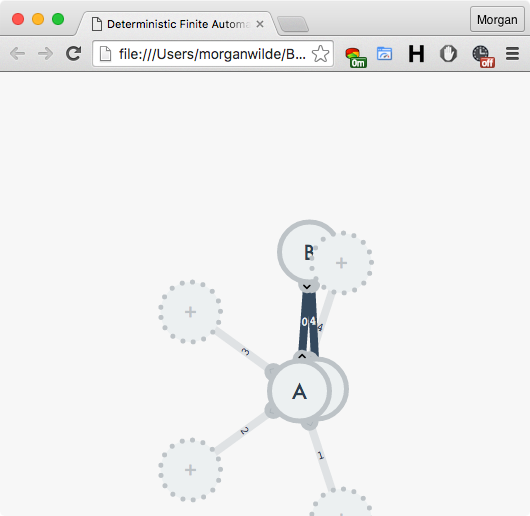

# The Process - Visualization of a Deterministic Finite Automata

1. ### How to draw a graph so that links are always under nodes?
   - Do it in two passes, first drawing the links and then the nodes.
2. ### How to position nodes?
   - Define a circle around a node and divide it by the number of possible outgoing links.
3. ### How to draw the link's arrowhead?
   - Define a polygon using vector rotation/addition.
4. ### Text alignment next to the link?
   - I'll try to draw a box of fixed size and rotate it so that one edge touches the link.
   - `01:13` I'm having issues with rotation, the red squares don't align with the lines.
   
   
   
   - `01:23` Fixed the rotation issue, turns out I was misusing `Math.atan()` and accidentally swapped `x` with `y`.
   
   
   
   - `01:31` I have Vector math related issues. My origin is wrong.
   - `02:01` Fixed the Vector math issues. Turns out my mid-point math was off. Transferred most calculations over to Vector.
   
   
   
   - `02:05` Came up with the idea to position the link labels in the center of the link itself. Need to add a white background so that there appears to be gap and the position the label in the middle.
   
   
   
   - `02:16` Happy with the result.
   
   
   
5. ### How to draw overlapping Links?
   - `11:31` Links overlap each other and there's no way to tell the directionality of the link.
   - `11:41` Still not happy with the label positioning, taking a new approach to try and perfectly center the label.
   
   
   
   - `12:13` I've changed the font to a monospaced one. Now I can calculate the width of the label without having to render. I now center the text myself.
   
   
   
   
   - `13:38` Solved the arrow positioning problem by refactor the code to use the new Vector object.
   
   
   
   
   - `13:42` The illustration of how the primitive overlap case looks like.
   
   
   
   - `14:09` First attempt. The end points don't look right. And since I adjust for the arrow, the length is off also.
   
   
   
   - `15:31` Will start playing around with arrows. Now logging commits with every change.
   
   
   
   - `18:37` Realised that it would be too detailed, so I abandoned the curvy approach.
   
   
   
   - `18:39` Decided to go with shifting the lines around. Still need to test the other positions before I go ahead.
   
   
   
   - `19:21` I think the overlap issue has been resolved. Not 100% percent (if you have one link on one side, and another that's reciprocal on the opposite, that one link will not be perfectly centered between the two reciprocal links), but sufficiently so.
   
   
   
6. ### How to draw temporary links?
   - `00:31` This should work for now. I've changed the color and the dot frequency.
   
   
   
   - `00:33` I now need to come up with a good way to display node placeholders. I think dots could work for the stroke around the circle, and the fill should be transparent with the label always being the same (either empty or some non-alphanumeric character).
   
   - `01:52` On the way I figured to better use a hack and adjust the label's positioning arbitrarily than to leave it in a seamingly incorrect position.
   
   
   
   - `02:01` The plus sign seems appropriate as a placeholder.
   
   
   
7. ### A method to draw temporary NodeViews and LinkViews
   - `02:16` To be able to show the temporary links on hover, I need to add them to the hieararchy, but I also need to remove them once the mouse is out. So in addition to the `draw()` method, I'm adding an `update()` method that will be responsible with delta updates to the link and state views.
   - `03:07` I now have a working solution for mouse over/out on an existing node (tested with only one central node). But the mouse out event hides all the nodes and prevents from going over to a specific node you'd like to add. Need to fix this, not sure how yet.
   
   
   
8. ### The mechanism for adding new nodes to the graph
   - `03:10` One issue that is immediatelly obvious is the reciprocal link not being shifted for the temporary link.
   
   
   
   - `22.01 12:58` Another way of solving the reciprocal link would be to fit everything on one line, as suggested in this [answer](http://graphicdesign.stackexchange.com/questions/65842/how-to-design-arrow-links-between-two-nodes/65848#65848). But this requires that the symbol be the same, because there is no room for two labels. I now have to rotate the links around the reciprocating node.
   
   - `22.01 13:34` While working on the previous issue, I found the alphabets having an uneven number of letters produce this misaligned picture. I need to always adjust the rotation of the receiving node.
   
   
   
   - `22.01 14:09` The solution was pretty obvious looking back, just rotate the link 180 degrees.
   
   
   
   - `22.01 14:33` Solved the hover issue by introducing a timer once you leave a node.
   
   
   
   - `22.01 14:45` Now I need to create the node itself and the link leading up to it.
   
   - `22.01 15:08` The functionality for adding new nodes is complete. But there are other issues related to rotating the origin for new links.
   
   
   
   - `22.01 15:39` Rotation now works in all tested cases.
   
   
   
   - `22.01 15:48` I need to set the reciprocal flag on back links when I create them.
   
   - `22.01 16:08` I've added an update method on `LinkView` to allow me to redraw it when properties change. Otherwise only new additions to the graph would be drawn.
   
   
   
9. ### The mechanism for moving existing nodes around
   - `22.01 16:10` I first need to change the on mouse down event to not trigger node creation. Change that to mouse up.
   - `22.01 17:17` You can now move nodes. `NodeView` now also has an `update()` method.
   
   
   
   - `22.01 17:20` Fixed an inconveniece where after moving a node you had to exit and enter the node again to see the interface for adding linked nodes.
   
   
   
10. ### Change `LinkView` design
   - `22.01 17:24` I will change the overall look for the link as per suggestions in this SE [answer](http://graphicdesign.stackexchange.com/questions/65842/how-to-design-arrow-links-between-two-nodes/65848#65848).
   - `22.01 20:17` The changes to accomodate this new design are not limited to `LinkView`, I now have to change the model to have reciprocal `Link`s.
   
   
   
   - `22.01 20:52` The model now is pretty much adjusted (except for the missing removal methods). Next up is the modified bidrectional arrow placement.
   
   
   
   - `22.01 21:08` Repositioning the arrows means getting rid of all previous hacks without losing perfect centering along the link. So far so good.
   
   
   
   - `22.01 21:35` Finally cleaned everything up to a point where I could implement the new arrow stiling. Looks much better! In terms of visuals, I need to implement the reciprocal case.
   
   
   
   - `22.01 21:50` In the most trivial case - the new style works great. I haven't tested it out yet, so can't say about other cases.
   
   
   
   - `22.01 22:12` I need to fix the `drawStateCenteredAt()` method in my `AutomataController`, because it currently is generating link according to the old model.
   
   - `22.01 22:16` Turns out that was not a bug, the controller was just unable to draw a node that was unreachable from the starting node.
   
   - `22.01 22:19` I have to adjust the whole process for adding new nodes, because it is now broken.
   
   
   
   - `23.01 00:07` I feel like I've added extra complexity now and it's hard to trace where the issues are coming from. Still, the ability to add new nodes is back online.
   
   
   
   - `23.01 00:15` Added a mouse over effect on `NodeView` placeholders.
   
   
   
   - `23.01 00:16` To help with readability, I will flip transition labels 180 degrees when they're rotating upside down.
   
   
   
   - `23.01 12:42` I fixed the bug that broke the new node mechanism if you hovered over other possible nodes. I did this by introducing checks in the setter/getter methods of `AutomataController.hidePossibleLinksStateView`.
   
   
   
11. ### Remaining bugs in the current version
   - `23.01 12:46` Before continuing with new features, such as the ability to
      1. push the moving node atop everything else so that there is free movement
      1. don't stop moving the node until there is a mouse up event
      1. drag temporary nodes onto existing ones, and create reciprocal links that way;
      1. mark an entry node visually;
      2. mark end nodes;
      3. save the current graph into `window.sessionStorage`;
      4. create self-loops;
      5. delete links;
      6. the parser itself;
      
      I need to resolve the remaining bugs:
      1. reciprocal links draw over the existing link, making the label less visible, it should draw a new link, just the end point;
      2. the arrow graphic on temporary links is almost invisible, it should look just like the normal one;
      3. temporary nodes are rendered without taking into account the current graph, thus they overlay other visual items;
12. ### Critical path to a demo
   - `24.01 23:25` I feel that I need to get to a demo ASAP, because the length of this sideproject has extended beyond my expectations. The main thing that's missing is the ability to create a loop. Let's hope a quick drag and drop will sufice for a solution. But first I need to bring the current node up in DOM hierarchy.
   
   
   
   - `24.01 23:51` I've moved the mouse movement handling responsibilities over to the controlls (as I should've), and bring back the view up forward. Works great.
   
   
   
   - `25.01 00:13` I think I've nailed the UI for dropping nodes on top of other nodes to create links.
   
   
   
   - `25.01 00:37` Got loops to work (tons of bugs, but the functionality is there)! Only thing before string input is to assign accept nodes.
   
   
   
   - `25.01 00:54` Entry/Exit states properties are done both on the model and the view. Next stop - simulation and animation!!!
   
   
   
   - `25.01 01:29` The UI for string input is done. It's a bit of a hack for now, but on the critical path. The next item is to iterate over each memeber of the string.
   
   
   
   
   
   - `25.01 17:00` So the critical path approach definitely worked in that I have something to demo now!
   
   